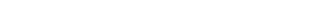
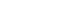
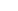
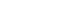
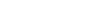
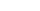

# Ray-Tracer

A Ray-Tracer is a garphical computer software that simulates the way light interacts with objects to create highly realistic scenes and environments. It computes the color of pixels in an image by tracking the path of light
rays backwards from the eye (camera) through each pixel in an image plane and simulates the effects of the following encounters with virtual objects. The fundamental equation governing the practice of Ray Tracing is the 'rendering' equation, which is used to model this transportation of light. The equation is typically expressed as:

 

where:
-   is the outgoing light (radiance) from point **p** in direction  .
-   is the emitted light from point **p** in direction , which is typically non-zero only for light sources.
-   is the bidirectional reflectance distribution function (BRDF) at point **p**, describing how light is reflected at an opaque surface.
-  is the incident light at point **p** coming from direction .
-  is the cosine of the angle between the incoming light direction  and the surface normal **n**

  
In practice, the rendering equation is solved using [Monte Carlo](https://en.wikipedia.org/wiki/Monte_Carlo_method) or other numerical methods that simulate the contributions of a large number of light paths, which collectively approximate the integral for realistic lighting effects.

This Ray Tracer is created in Python using only the given libraries/modules that come with an installation of Python (3.8+), so there's no need to replicate an enviornment, simply download the main file and run it in your preffered IDE. 
